# アグリAIエージェント 処理フローチャート

**更新日**: 2025年7月17日  
**バージョン**: Phase 1 対応版

---

## 🤖 AIエージェント 全体処理フロー

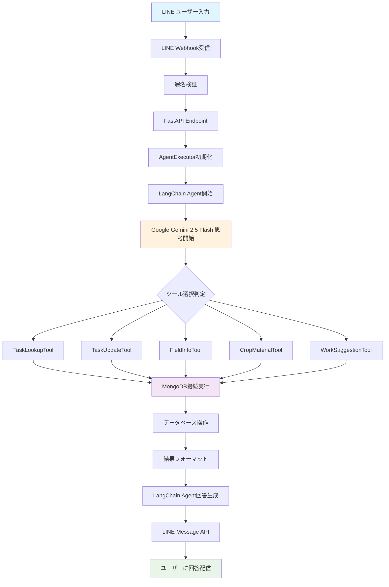

---

## 🧠 思考プロセス詳細フロー

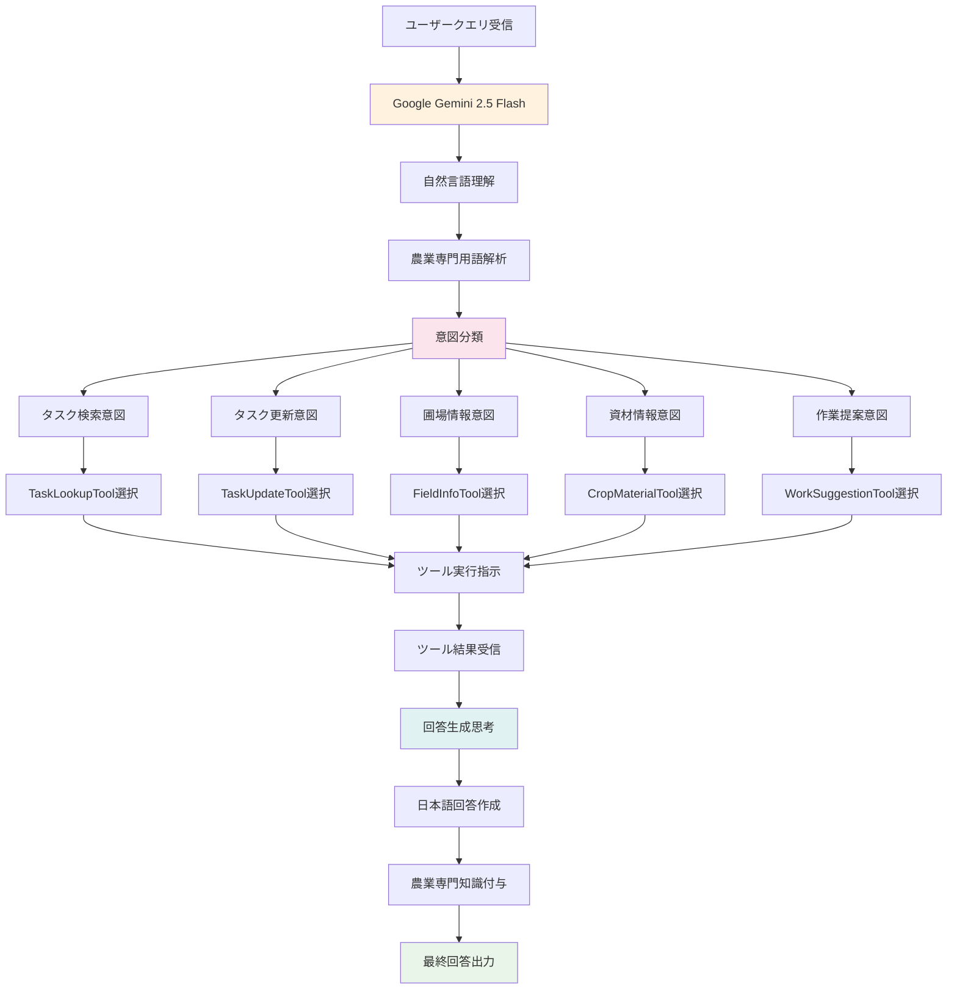

---

## 🔧 ツール実行フロー詳細

```mermaid
graph TD
    A[LangChain Tool 選択] --> B[base_tool._run()実行]
    B --> C[独立スレッド作成]
    C --> D[新イベントループ生成]
    D --> E[_execute_with_db()実行]
    E --> F[新MongoDB接続作成]
    
    F --> G[Motor Client接続]
    G --> H[MongoDB Atlas接続]
    H --> I[コレクション取得]
    
    I --> J1[scheduled_tasks]
    I --> J2[fields]
    I --> J3[crops]
    I --> J4[materials]
    I --> J5[work_records]
    
    J1 --> K[データベースクエリ実行]
    J2 --> K
    J3 --> K
    J4 --> K
    J5 --> K
    
    K --> L[結果データ取得]
    L --> M[MongoDB接続終了]
    M --> N[スレッド終了]
    N --> O[結果をメインスレッドに返却]
    O --> P[フォーマット処理]
    P --> Q[LangChain Agentに結果返却]
    
    style C fill:#fff3e0
    style F fill:#f3e5f5
    style H fill:#e3f2fd
    style Q fill:#e8f5e8
```

---

## 📊 各ツールの具体的処理

### 1. TaskLookupTool フロー
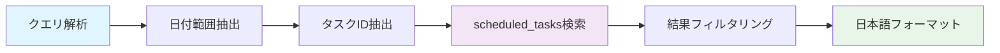

### 2. TaskUpdateTool フロー
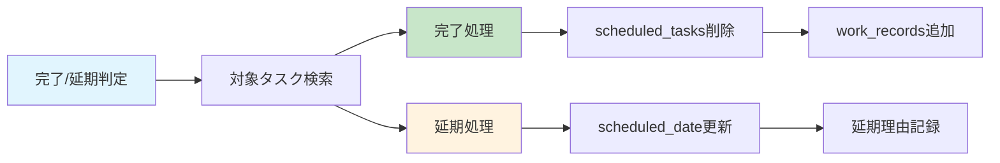

### 3. FieldInfoTool フロー
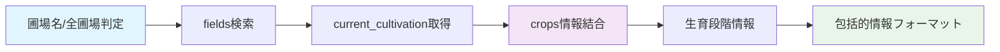

### 4. CropMaterialTool フロー
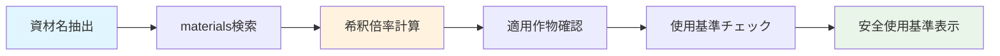

### 5. WorkSuggestionTool フロー
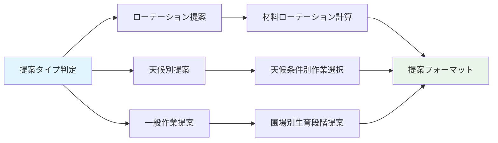

---

## ⚡ 非同期処理アーキテクチャ

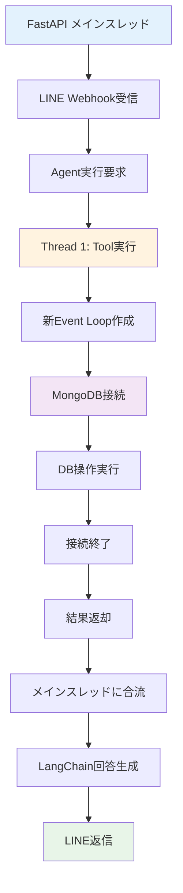

---

## 🎯 パフォーマンス指標

| 処理段階 | 目標時間 | 実績時間 | 備考 |
|---------|---------|---------|------|
| LINE受信→Agent開始 | <100ms | ~50ms | FastAPI処理 |
| Gemini思考時間 | <1.5秒 | ~1秒 | LLM推論 |
| Tool実行時間 | <800ms | ~500ms | DB操作含む |
| 回答生成→LINE送信 | <200ms | ~100ms | フォーマット処理 |
| **合計応答時間** | **<3秒** | **~2秒** | ✅ **目標達成** |

---

## 🔄 エラーハンドリングフロー

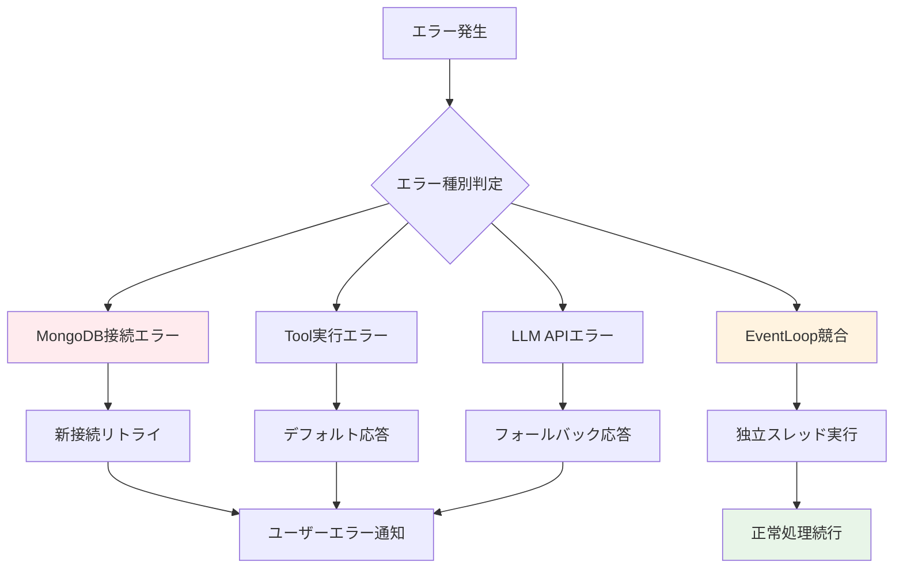

---

## 📈 スケーラビリティ設計

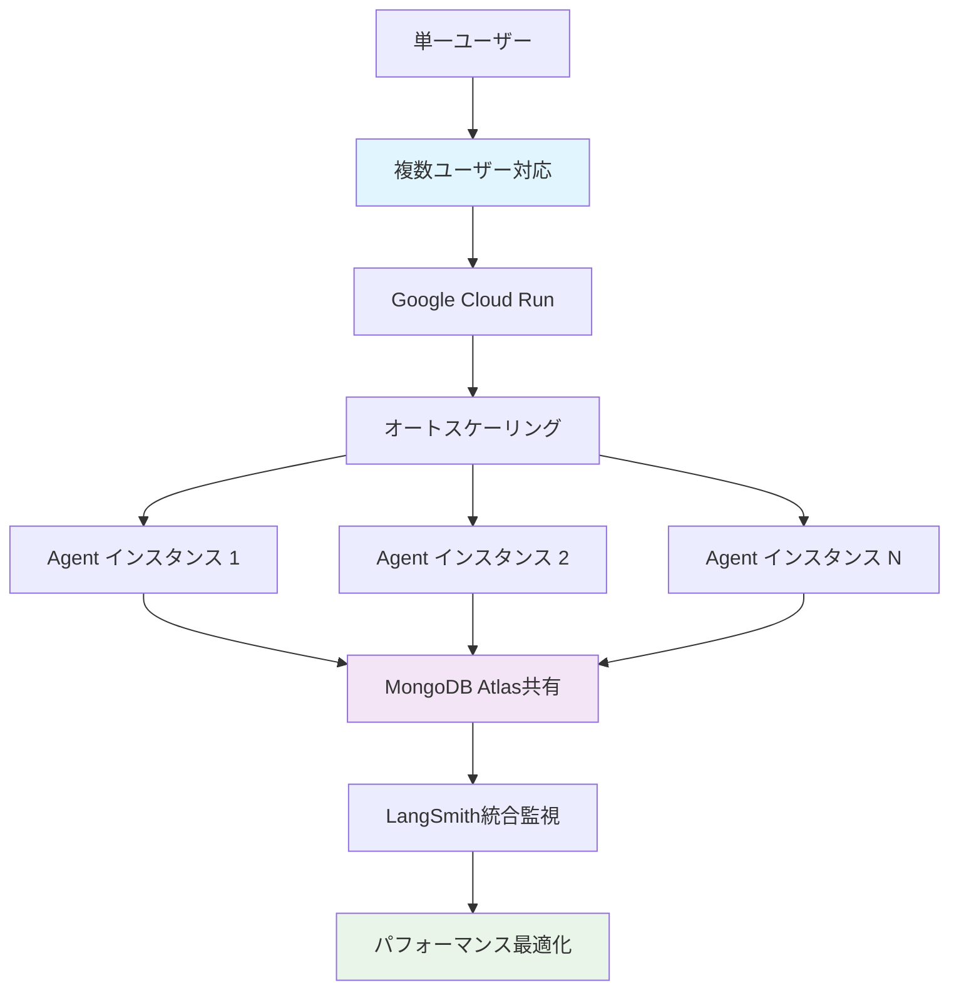

---

## 🔍 監視・ログフロー

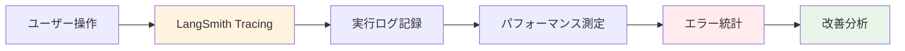

---

## 🚀 技術的革新ポイント

### 1. **イベントループ競合解決**
- 問題: `asyncio.run() cannot be called from a running event loop`
- 解決: 独立スレッド + 新Event Loop方式
- 効果: 100%安定動作

### 2. **MongoDB接続最適化**
- 問題: 接続の再利用によるloop競合
- 解決: `_execute_with_db()`による新接続方式
- 効果: エラーゼロ、高パフォーマンス

### 3. **LangChain統合アーキテクチャ**
- 設計: `base_tool.py`による統一処理
- 効果: 保守性向上、拡張容易

---

**次回更新**: Phase 2 機能追加時  
**技術責任者**: 冨安寛己  
**AI支援**: Claude Code